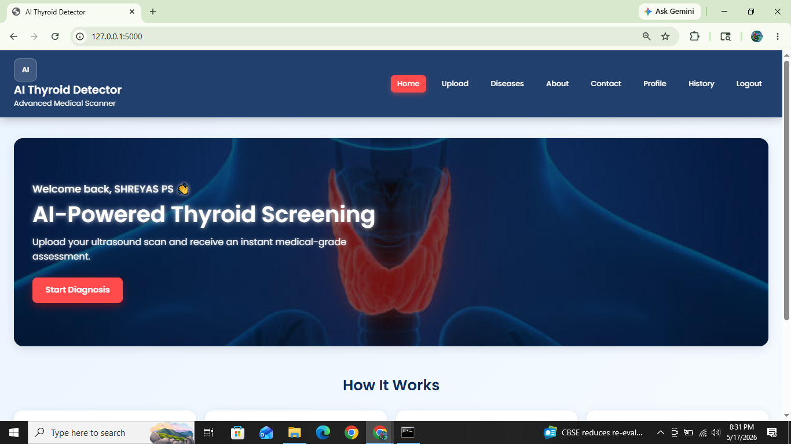
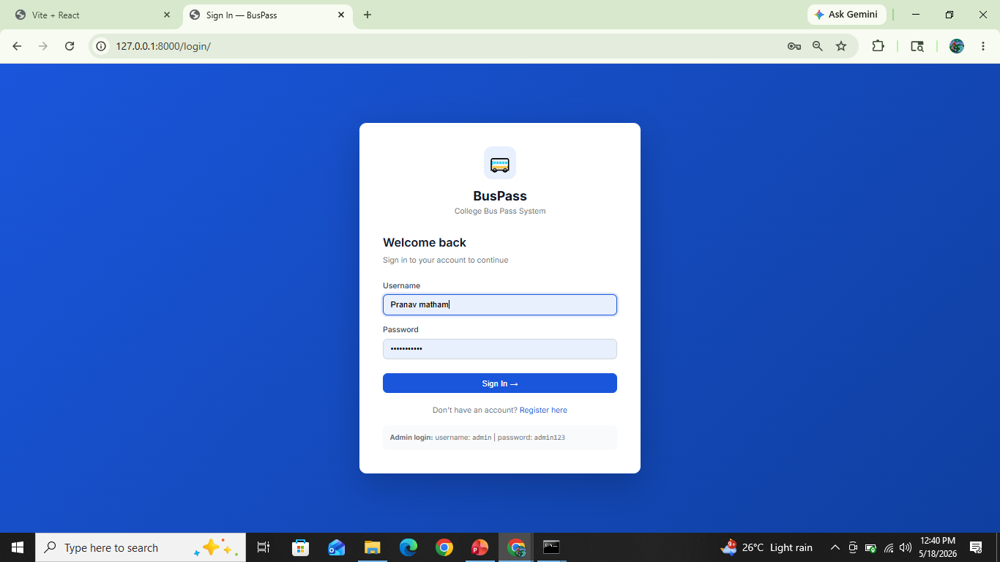
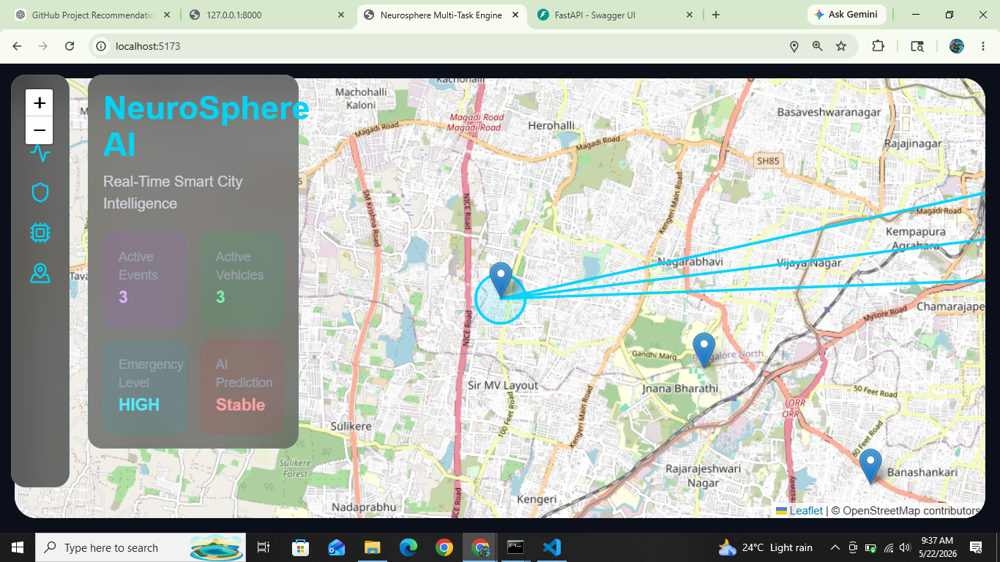
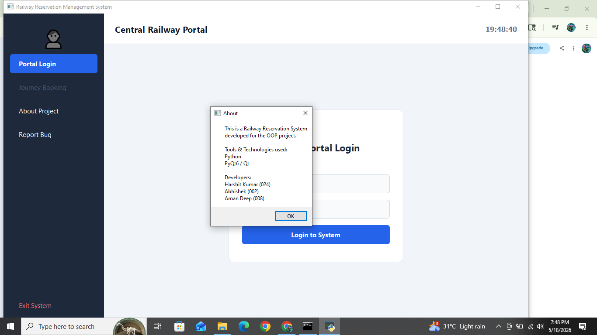
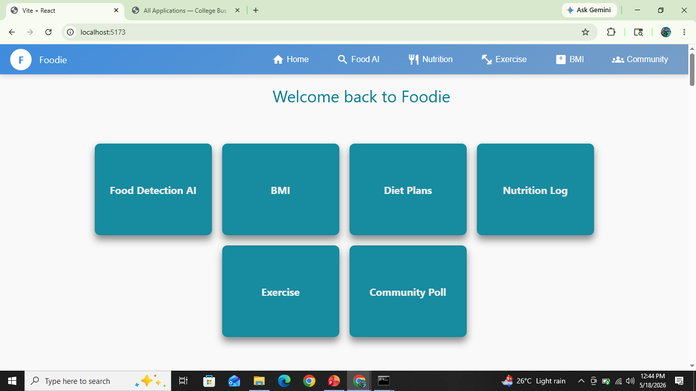
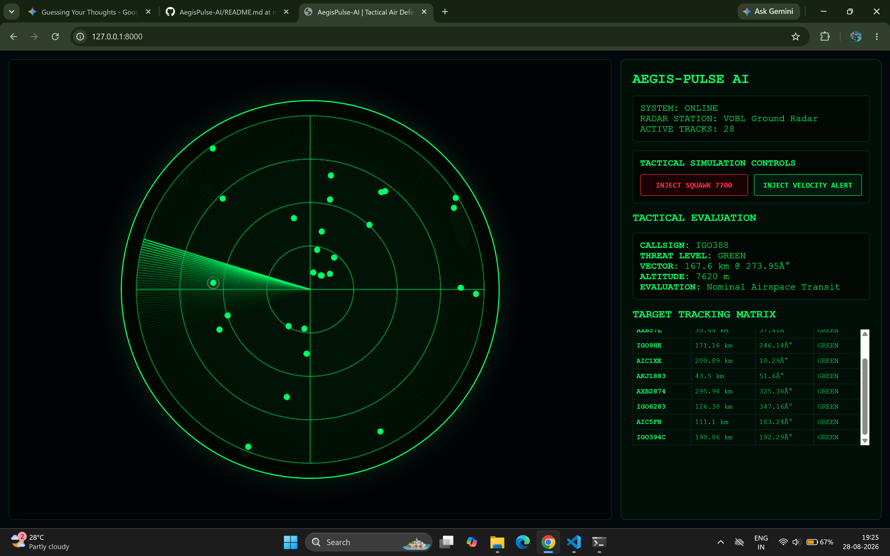

🚀 Pranav Matham — Developer Portfolio

A fast, responsive personal portfolio that showcases my projects, skills, and experience as a Python full-stack and AI/ML developer. Built with plain HTML, CSS, and JavaScript — no frameworks, no build step.

🌐 Live site: my-portfolio-eta-six-36.vercel.app 📄 Resume: Download PDF

✨ Key Features
Hero section with a terminal-style intro card (whoami, focus, location) and quick links to GitHub, LinkedIn, resume, and email.
Project showcase with preview images, tech-stack tags, and links to each project's GitHub repository.
Category filter to browse projects by All, Software, AI / ML, or Systems.
"Explore architecture" panel on every project card, showing the build pipeline and the role of the build.
Skills and experience sections covering languages, web basics, databases, tools, internship, and education.
Responsive layout with a mobile menu, so it works on phones, tablets, and desktops.
Direct contact links for email, LinkedIn, GitHub, and resume download.
A small surprise — a cat animation hidden in the page (assets in assets/cat).
🛠️ Tech Stack
Layer	Technologies
Markup	HTML5
Styling	CSS3 (custom styles, responsive layout)
Interactivity	Vanilla JavaScript
Hosting	Vercel
Version Control	Git, GitHub
📁 Project Structure
My-Portfolio/
├── index.html                  # Page structure and content
├── style.css                   # All styling and responsive rules
├── script.js                   # Project filter, architecture panel, menu, animations
├── Pranav_Matham_Resume.pdf    # Downloadable resume
├── assets/                     # Extra images (cat animation frames)
├── thyroid.png                 # Project preview images
├── buspass.png
├── NeuroSphere-X.png
├── railway.png
├── Nutri-AI.png
└── home.png
🗂️ Featured Projects
Project	What it is	Tech	Repository
Thyroid Nodule Detection Engine	CNN-based detection and classification of thyroid nodules from ultrasound images	Python, TensorFlow, EfficientNet, OpenCV	View
BusPass Automation Engine	Online college bus pass applications with login, validation, and admin approval	Python, Django, SQLite	View
NeuroSphere-X Smart City	Real-time urban analytics with live dashboards, heatmaps, and WebSocket telemetry	FastAPI, React, WebSockets	View
Railway Reservation System	Cross-platform ticket booking app	Flutter, Firebase	View
Nutri-AI Nutrition Vision	Food recognition with nutrition mapping	Python, OpenCV, React, REST	View
Smart Autonomous Home Node	ESP32 sensing concept with telemetry and remote controls	C++, ESP32, WebSockets	—
🚀 Run It Locally

No installation is needed, because the site is plain HTML, CSS, and JavaScript.

Clone the repository
bash
git clone https://github.com/PRANAV-MS25/My-Portfolio.git
cd My-Portfolio
Open the site

Double-click index.html, or start a small local server:

bash
python -m http.server 8000

Then open http://localhost:8000 in your browser.

☁️ Deployment

The site is hosted on Vercel as a static site. Every push to the main branch updates the live version.

📸 Project Previews
Thyroid Nodule Detection	BusPass Automation	NeuroSphere-X Smart City
		
CNN-based ultrasound analysis with Grad-CAM	Online bus pass workflow with admin approval	Live telemetry dashboard and heatmaps
Railway Reservation	Nutri-AI Nutrition Vision	Smart Autonomous Home Node
		
Ticket booking flow	Food recognition and nutrition mapping	Sensor telemetry and alerts
👨‍💻 Developer & Contact

Developed by Pranav Matham, Computer Science graduate (2026), Bengaluru, India.

Email: mathampranav@gmail.com
LinkedIn: pranav-matham
GitHub: PRANAV-MS25
Portfolio: my-portfolio-eta-six-36.vercel.app
